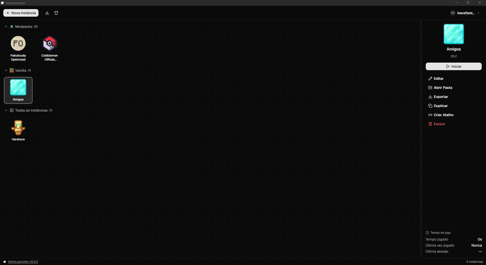
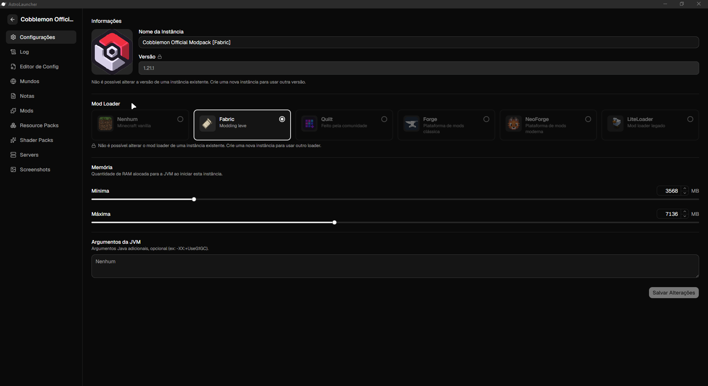
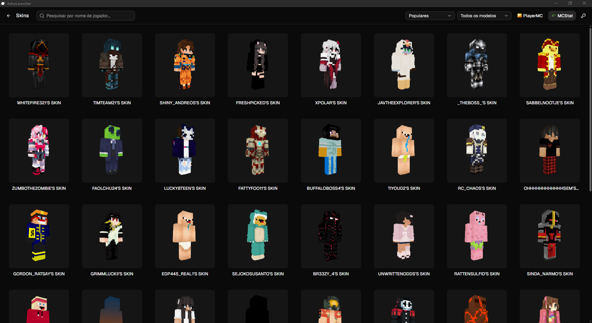
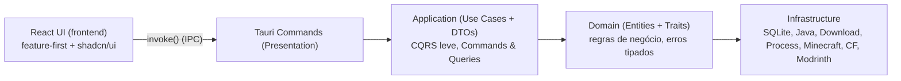

<p align="center">
  
</p>

<h1 align="center" style="border-bottom: 0;">AstroLauncher</h1>

<p align="center">
  Launcher de Minecraft: Rust + Tauri no backend, React + shadcn/ui no frontend. 🚀
</p>

<!-- ══════════════ BADGES ══════════════ -->

<p align="center">
  
  
  
  
  
  
  
</p>

<br />

## 📥 Download

O **AstroLauncher** é gratuito e open source. Baixe a versão mais recente direto do GitHub:

<p align="center">
  <a href="https://github.com/kauafpssx/AstroLauncher/releases/latest">
    
  </a>
</p>

| O que vem no pacote             | Como funciona                                             |
| ------------------------------- | --------------------------------------------------------- |
| 🖥️ **Instalador `.exe` (NSIS)** | Instala por usuário, sem precisar de admin                |
| 🔄 **Auto-update**              | A splash verifica e instala novas versões automaticamente |
| 📦 **Arquivos `.astropack`**    | Duplo clique importa a instância direto no launcher       |

> [!TIP]
> Novas versões saem pelo **GitHub Releases**. O botão acima sempre aponta para a mais recente.

<br />

## 📖 Índice

- [📥 Download](#-download)
- [🚀 Sobre o projeto](#-sobre-o-projeto)
- [✨ Funcionalidades](#-funcionalidades)
- [🖼️ Screenshots](#-screenshots)
- [🧩 Loaders e versões suportadas](#-loaders-e-versões-suportadas)
- [🧱 Stack de tecnologias](#-stack-de-tecnologias)
- [📐 Arquitetura](#-arquitetura)
- [📂 Estrutura do projeto](#-estrutura-do-projeto)
- [🔧 Desenvolvimento](#-desenvolvimento)
- [📦 Build e distribuição](#-build-e-distribuição)
- [⚖️ Aviso legal](#-aviso-legal)
- [🤝 Contribuindo](#-contribuindo)
- [📄 Licença](#-licença)

## 🚀 Sobre o projeto

**AstroLauncher** é um launcher de Minecraft construído do zero, inspirado no [PrismLauncher](https://prismlauncher.org/), com foco em arquitetura limpa e facilidade de manutenção. A interface usa [shadcn/ui](https://ui.shadcn.com/), com componentes Radix UI e Tailwind CSS. Do grid de instâncias ao visualizador de skins 3D, cada tela foi pensada para ser rápida e agradável de usar.

Ele roda **todas as versões do jogo**, de classic e infdev (2009) às releases e snapshots mais recentes, com os principais loaders (**Fabric, Quilt, Forge, NeoForge e LiteLoader**). Num único lugar você tem instalação de mods e modpacks via **Modrinth e CurseForge**, contas offline, download automático de Java, playtime, atalhos de desktop e exportação de instâncias completas em `.astropack`.


> 🎯 **Público-alvo:** jogadores que precisam de contas offline (crackeado) e suporte a múltiplas versões e loaders num único launcher.

### ✨ Funcionalidades

|     | Feature                   | Descrição                                                                           |
| --- | ------------------------- | ----------------------------------------------------------------------------------- |
| 🪐  | **Splash screen**         | Tela de abertura com checagem automática de atualização                             |
| 🧊  | **Instâncias**            | Criar, editar, excluir e organizar instâncias em **pastas** com drag & drop         |
| 🕰️  | **Todas as versões**      | Releases, snapshots, alphas, betas, infdev, classic e indev (desde 2009!)           |
| 🧩  | **Multi-loader**          | Fabric, Quilt, Forge, NeoForge e LiteLoader                                         |
| 👤  | **Contas offline**        | Modo crackeado com gerenciador de contas e reordenação por drag & drop              |
| ☕  | **Java Manager**          | Detecção e download automático de runtimes (Adoptium Temurin)                       |
| ⏱️  | **Playtime**              | Tempo de jogo por instância, sessões e estatísticas                                 |
| 🧪  | **Mod Browser**           | Busca e instalação de mods via **Modrinth** e **CurseForge**                        |
| 📦  | **Modpacks**              | Instalação direta de modpacks (.mrpack e manifest do CurseForge)                    |
| ⚙️  | **Editor de Config**      | `options.txt` tipado, arquivos de `config/` e **Keybinds** com detecção de conflito |
| 📝  | **Notas**                 | Múltiplas notas por instância, exportadas no `.astropack`                           |
| 🖼️  | **Ícones customizados**   | Presets de blocos/itens ou upload com recorte (crop)                                |
| 👕  | **Galeria de skins**      | Fontes **PlayerMC + MCStat**, filtro Classic/Slim e preview 3D (skinview3d)         |
| 💬  | **Discord RPC**           | Status do jogo exibido no perfil do Discord                                         |
| 📜  | **Console**               | Log do Minecraft em tempo real                                                      |
| 🪄  | **AstroPack**             | Exportar/importar instâncias completas (`.astropack`)                               |
| 🖱️  | **Atalhos de desktop**    | Criar atalho da instância na área de trabalho, com ícone customizado                |
| 📂  | **Arquivos `.astropack`** | Duplo clique importa instâncias; atalhos abrem o jogo direto                        |
| 📋  | **Duplicar instância**    | Cópia completa com mods, mundos e configurações                                     |
| 🌍  | **Mundos**                | Gerenciar os mundos salvos da instância                                             |
| 🔌  | **Servidores**            | Editor visual do `servers.dat` (multiplayer)                                        |
| 📸  | **Screenshots**           | Visualizador das capturas da instância com zoom                                     |
| 🎨  | **Conteúdo instalado**    | Mods, Resource Packs e Shaders: ativar, desativar e excluir                         |
| 🧠  | **Sugestão de RAM**       | Recomendação de memória automática conforme a quantidade de mods                    |
| 🗞️  | **Changelog in-app**      | Notas de versão acessíveis direto no launcher, offline                              |

## 🖼️ Screenshots

| Home (instâncias)                  | Editor de instância                                 | Galeria de skins                                |
| ---------------------------------- | --------------------------------------------------- | ----------------------------------------------- |
|  |  |  |

## 🧩 Loaders e versões suportadas

- 🟢 **Vanilla**: qualquer versão do manifesto Mojang
- 🟢 **Fabric**: loader leve e moderno
- 🟢 **Quilt**: fork do Fabric com foco em comunidade
- 🟢 **Forge**: moderno (1.13+), via instalador oficial + processors
- 🟢 **NeoForge**: moderno (1.13+), mesmo pipeline do Forge
- 🟢 **LiteLoader**: mecanismo tweaker (`launchwrapper`)

> 🕹️ **Versões suportadas:** o manifesto da Mojang inclui versões desde **2009**. O AstroLauncher separa por tipo: `release`, `snapshot`, `alpha`, `beta`, `infdev`, `classic` e `indev`, e lida com a estrutura de assets de cada era (pré-1.6, pós-1.6, pós-1.7.10).

## 🧱 Stack de tecnologias

<table>
<tr><td><b>🦀 Backend</b></td><td>

 Rust &nbsp;
 Tauri 2 &nbsp;
 Tokio &nbsp;
 rusqlite (SQLite bundled)

</td></tr>
<tr><td><b>⚛️ Frontend</b></td><td>

 React 19 &nbsp;
 TypeScript &nbsp;
 Vite &nbsp;
 Tailwind CSS 4

</td></tr>
<tr><td><b>🎨 UI</b></td><td>

 shadcn/ui &nbsp;
 Radix UI &nbsp;
 lucide-react

</td></tr>
<tr><td><b>🗄️ Estado</b></td><td>


</td></tr>
<tr><td><b>🧙 Minecraft</b></td><td>

 &nbsp;


</td></tr>
<tr><td><b>🌐 APIs</b></td><td>

 &nbsp;
 Modrinth API v3 &nbsp;
 CurseForge Core API &nbsp;
 &nbsp;
 &nbsp;


</td></tr>
<tr><td><b>📊 Dados</b></td><td>

 SQLite &nbsp;
 JSON &nbsp;
sem cache, dados sempre atualizados das APIs

</td></tr>
<tr><td><b>🎵 Extras</b></td><td>

 &nbsp;
 discord-rich-presence &nbsp;
 &nbsp;


</td></tr>
</table>

## 📐 Arquitetura

Arquitetura **limpa**, **hexagonal** (Ports & Adapters) e **DDD Lite**, onde o domínio nunca depende de I/O:



> 📐 **Regra fundamental:** a UI conversa apenas com use cases expostos via comandos Tauri, nunca diretamente com a Infrastructure.

| Camada                | Responsabilidade                                                  |
| --------------------- | ----------------------------------------------------------------- |
| 🖥️ **Presentation**   | Comandos `#[tauri::command]`, estado gerenciado, IPC              |
| 🧠 **Application**    | Casos de uso, commands/queries, DTOs e mappers                    |
| 🏛️ **Domain**         | Entidades, value objects, traits de repositório, erros tipados    |
| 🔌 **Infrastructure** | SQLite, download manager, processo, Java, Minecraft, APIs de mods |

**Princípios:** Dependency Inversion, Composição sobre herança, Fail fast, Repository Pattern, CQRS-lite e SOLID

## 📂 Estrutura do projeto

<details>
<summary>🗃️ Clique para expandir a estrutura completa</summary>

```text
AstroLauncher/
├── src/                        # 🎨 Frontend (React + TS)
│   ├── components/             #   UI (shadcn/ui) + layout + splash
│   ├── features/               #   feature-first: instances, mods, skins...
│   │   ├── instances/          #     criação, edição, astropack, ícones
│   │   ├── mods/               #     browser de mods e modpacks
│   │   ├── accounts/           #     gerenciamento de contas
│   │   ├── skins/              #     skins + visualizador 3D
│   │   └── settings/           #     configurações do launcher
│   ├── stores/                 #   Zustand stores
│   ├── lib/                    #   API client, utilitários
│   └── types/                  #   tipos espelhando os DTOs
├── src-tauri/                  # 🦀 Backend (Rust + Tauri)
│   └── app/
│       ├── application/        #   use cases, DTOs, mappers
│       ├── bootstrap/          #   inicialização e wiring do app
│       ├── domain/             #   entidades, traits, erros
│       ├── infrastructure/     #   minecraft, java, downloader,
│       │                       #   process, persistence (SQLite),
│       │                       #   filesystem, discord, modloader,
│       │                       #   curseforge, modrinth, playermc
│       └── presentation/       #   comandos Tauri, estado, IPC
├── public/                     # 🖼️ Assets estáticos (logo, ícones, providers)
├── .github/
│   ├── workflows/              #   CI/CD:
│   │   ├── build.yml           #     release manual: build + tag + updater
│   │   └── quality-gate.yml    #     lint, prettier, typecheck, build e testes
│   └── releases/               #   notas de release versionadas
├── components.json             # shadcn/ui config
└── package.json
```

</details>

## 🔧 Desenvolvimento

### ✅ Pré-requisitos

- [Node.js](https://nodejs.org) **20+**
- [Rust](https://rustup.rs) **stable** (toolchain completa)
- [WebView2](https://developer.microsoft.com/microsoft-edge/webview2/) (Windows)

### 🚀 Rodando localmente

```bash
# 1. Instala as dependências
npm install

# 2. Roda em modo desenvolvimento (com splash screen)
npm run dev:tauri

# 3. Ou roda sem splash screen (mais rápido para dev)
npm run dev:tauri:fast
```

> [!TIP]
> O modo `dev:tauri:fast` pula a splash screen, a checagem de atualização e o delay artificial, ideal para iterar no código.

### 📜 Scripts disponíveis

| Script                   | Descrição                                 |
| ------------------------ | ----------------------------------------- |
| `npm run dev`            | Só o frontend (Vite)                      |
| `npm run dev:tauri`      | App completo em modo dev                  |
| `npm run dev:tauri:fast` | App em modo dev sem splash                |
| `npm run build`          | Typecheck + build de produção do frontend |
| `npm run lint`           | ESLint em todo o código                   |
| `npm run tauri build`    | Build completo do instalador              |

## 📦 Build e distribuição

O **build de release** é manual, disparado via GitHub Actions (`.github/workflows/build.yml`, `workflow_dispatch`), e gera o instalador assinado. Já o **Quality Gate** (`quality-gate.yml`) roda em todo push/PR com lint, prettier, typecheck, build e testes:

```mermaid
graph LR
    A[workflow_dispatch (manual)] --> B[Setup Node e Rust]
    B --> C[Build Tauri assinado]
    C --> D[NSIS .exe]
    D --> F[Create tag + Release]
    F --> G[Generate updater manifest]
    G --> H[Auto-update in-app 🪐]
```

| Artefato                | Formato       | Uso                                  |
| ----------------------- | ------------- | ------------------------------------ |
| 🖥️ **NSIS Installer**   | `.exe`        | Instalador padrão                    |
| 🔄 **Updater manifest** | `latest.json` | Atualização automática pelo launcher |

> [!IMPORTANT]
> A integração com a **CurseForge Core API** exige uma API key. Ela é injetada no CI via secret `CURSEFORGE_API_KEY` (variável de ambiente `CURSEFORGE_API_KEY`).

## ⚖️ Aviso legal

O **AstroLauncher** é um projeto **independente e open source**, sem qualquer afiliação com a **Mojang Studios** ou a **Microsoft**. "Minecraft" é uma marca registrada da Mojang Synergies AB.

- No primeiro launch, o AstroLauncher baixa versões, bibliotecas e assets direto dos servidores oficiais da Mojang (e dos repositórios oficiais dos loaders). O launcher **não inclui nem distribui** arquivos do jogo.
- O suporte a **contas offline** é apenas um mecanismo técnico de autenticação local, sem envolvimento com o sistema de contas da Mojang.
- O uso de contas offline para jogar sem adquirir o jogo é de **inteira responsabilidade do usuário**.

> [!IMPORTANT]
> Adquira o Minecraft oficialmente para jogar com todo o suporte, atualizações e funcionalidades online.

## 🤝 Contribuindo

Contribuições são bem-vindas.

```bash
# 1. Faça um fork do repositório
# 2. Crie uma branch para sua feature
git checkout -b feat/minha-feature

# 3. Faça suas mudanças e commit
git commit -m "feat: adiciona minha feature"

# 4. Envie e abra um Pull Request
git push origin feat/minha-feature
```

> 💡 **Boas práticas do projeto:**
>
> - Arquivos com no máximo **200 linhas** (ideal 80 a 150)
> - Erros tipados com `thiserror`, nunca `String`
> - Código em **inglês**, comentários explicam o _porquê_, não o _o quê_
> - Funções e casos de uso pequenos e com responsabilidade única

## 📄 Licença

Distribuído sob a **GNU General Public License v3.0**. Veja o arquivo [`LICENSE`](LICENSE) ou [`COPYING.md`](COPYING.md) para os detalhes completos.

> ⚖️ **GPL-3.0:** uso, modificação e distribuição livres, desde que projetos derivados usem a mesma licença (copyleft).

<p align="center">
  Feito com 💜 no Brasil por <a href="http://instagram.com/kauafpss_">@kauafpss_</a>
</p>

<p align="center">
  <sub>🚀 Bora jogar?</sub>
</p>
