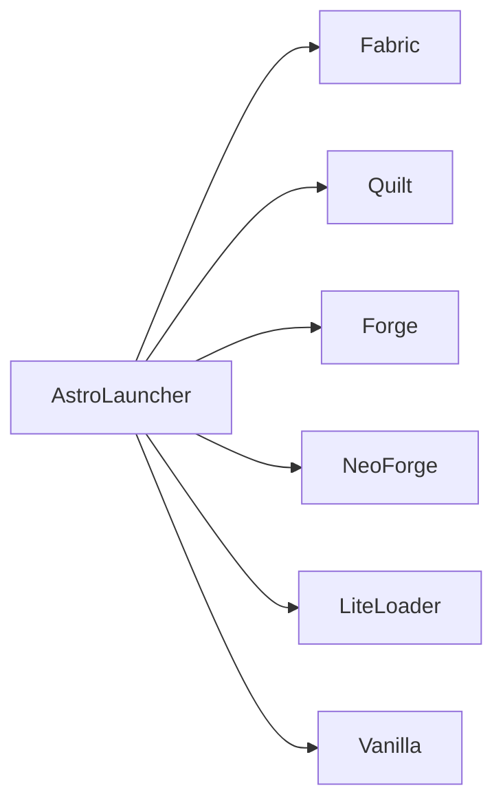
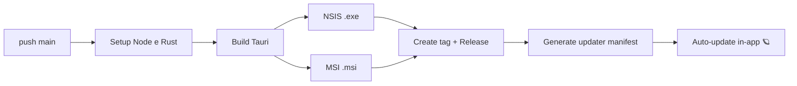

<p align="center">
  
</p>

<h1 align="center">AstroLauncher</h1>

<p align="center">
  O launcher de Minecraft <b>moderno</b>, <b>rápido</b> e <b>bonito</b>: Rust + Tauri no backend, React + shadcn/ui no frontend. 🚀
</p>

<br />

<!-- ══════════════ BADGES ══════════════ -->

<p align="center">
  <a href="https://github.com/kauafpssx/AstroLauncher/releases">
    
  </a>
  
  <a href="https://github.com/kauafpssx/AstroLauncher/actions/workflows/build.yml">
    
  </a>
  <a href="https://github.com/kauafpssx/AstroLauncher/releases">
    
  </a>
  <a href="LICENSE">
    
  </a>
</p>

<br />

---

## 📖 Índice

- [🚀 Sobre o projeto](#-sobre-o-projeto)
- [✨ Funcionalidades](#-funcionalidades)
- [🧩 Loaders e versões suportadas](#-loaders-e-versões-suportadas)
- [🧱 Stack de tecnologias](#-stack-de-tecnologias)
- [📐 Arquitetura](#-arquitetura)
- [📂 Estrutura do projeto](#-estrutura-do-projeto)
- [🔧 Desenvolvimento](#-desenvolvimento)
- [📦 Build e distribuição](#-build-e-distribuição)
- [🤝 Contribuindo](#-contribuindo)
- [📄 Licença](#-licença)

---

## 🚀 Sobre o projeto

O **AstroLauncher** é um launcher de Minecraft feito do zero, minimamente inspirado no [PrismLauncher](https://prismlauncher.org/), mas com foco em **arquitetura limpa**, **estética moderna** e **facilidade de manutenção**. A interface é **100% temática [shadcn/ui](https://ui.shadcn.com/)**, com componentes Radix UI e Tailwind CSS, garantindo um visual coeso, moderno e consistente em cada tela.

> 🎯 **Público-alvo:** jogadores que querem um launcher leve e rápido, com suporte a contas offline (crackeado) e múltiplas versões e loaders, sem perder a beleza da interface.

### 💎 Destaques

| | Feature | Descrição |
|---|---------|-----------|
| 🪐 | **Splash screen** | Tela de abertura com checagem automática de atualização |
| 🧊 | **Instâncias** | Criar, editar, excluir e organizar instâncias em **pastas** com drag & drop |
| 🕰️ | **Todas as versões** | Releases, snapshots, alphas, betas, infdev, classic e indev (desde 2009!) |
| 🧩 | **Multi-loader** | Fabric, Quilt, Forge, NeoForge e LiteLoader |
| 👤 | **Contas offline** | Modo crackeado com gerenciador de contas e reordenação por drag & drop |
| ☕ | **Java Manager** | Detecção e download automático de runtimes (Adoptium Temurin) |
| ⏱️ | **Playtime** | Tempo de jogo por instância, sessões e estatísticas |
| 🧪 | **Mod Browser** | Busca e instalação de mods via **Modrinth** e **CurseForge** |
| 📦 | **Modpacks** | Instalação direta de modpacks (.mrpack e manifest do CurseForge) |
| ⚙️ | **Editor de Config** | `options.txt` tipado, arquivos de `config/` e **Keybinds** com detecção de conflito |
| 📝 | **Notas** | Múltiplas notas por instância, exportadas no `.astropack` |
| 🖼️ | **Ícones customizados** | Presets de blocos/itens ou upload com recorte (crop) |
| 👕 | **Visualizador 3D** | Preview de skins 3D com skinview3d |
| 💬 | **Discord RPC** | Status do jogo exibido no perfil do Discord |
| 📜 | **Console** | Log do Minecraft em tempo real |
| 🪄 | **AstroPack** | Exportar/importar instâncias completas (`.astropack`) |

---

## 🧩 Loaders e versões suportadas



| Loader | Suporte | Observação |
|--------|:-------:|------------|
| 🟢 **Vanilla** | ✅ | Qualquer versão do manifesto Mojang |
| 🟢 **Fabric** | ✅ | Loader leve e moderno |
| 🟢 **Quilt** | ✅ | Fork do Fabric com foco em comunidade |
| 🟢 **Forge** | ✅ | Moderno (1.13+), via instalador oficial + processors |
| 🟢 **NeoForge** | ✅ | Moderno (1.13+), mesmo pipeline do Forge |
| 🟢 **LiteLoader** | ✅ | Mecanismo tweaker (`launchwrapper`) |

> 🕹️ **Versões suportadas:** o manifesto da Mojang inclui versões desde **2009**. O AstroLauncher separa por tipo: `release`, `snapshot`, `alpha`, `beta`, `infdev`, `classic` e `indev`, e lida com a estrutura de assets de cada era (pré-1.6, pós-1.6, pós-1.7.10).

---

## 🧱 Stack de tecnologias

| Camada | Tecnologias |
|--------|-------------|
| 🦀 **Backend** | Rust, Tauri 2, Tokio, rusqlite (SQLite bundled) |
| ⚛️ **Frontend** | React 19, TypeScript, Vite, Tailwind CSS 4 |
| 🎨 **UI** | shadcn/ui (Radix UI), lucide-react, phosphor-icons |
| 🗄️ **Estado** | Zustand, TanStack Query |
| 🧙 **Minecraft** | mc-launcher-core, mc_chat |
| 🌐 **APIs** | Mojang launchermeta, Modrinth API v3, CurseForge Core API |
| 📊 **Dados** | SQLite (dados), JSON (configs do usuário), cache com TTL |
| 🎵 **Extras** | cpal (áudio), discord-rich-presence, skinview3d, react-easy-crop |

---

## 📐 Arquitetura

Arquitetura **limpa**, **hexagonal** (Ports & Adapters) e **DDD Lite**, onde o domínio nunca depende de I/O:

```text
┌─────────────────────────────────────────────┐
│                React UI (frontend)          │
│            feature-first + shadcn/ui        │
└──────────────────────┬──────────────────────┘
                       │ invoke() (IPC)
┌──────────────────────▼──────────────────────┐
│      Tauri Commands (Presentation)          │
└──────────────────────┬──────────────────────┘
┌──────────────────────▼──────────────────────┐
│        Application (Use Cases + DTOs)       │
│        CQRS leve, Commands & Queries        │
└──────────────────────┬──────────────────────┘
┌──────────────────────▼──────────────────────┐
│        Domain (Entities + Traits)           │
│        regras de negócio, erros tipados     │
└──────────────────────┬──────────────────────┘
┌──────────────────────▼──────────────────────┐
│   Infrastructure (SQLite, Java, Download    │
│   , Process, Minecraft, CF, Modrinth)       │
└─────────────────────────────────────────────┘
```

> 📐 **Regra fundamental:** a UI nunca conversa diretamente com a Infrastructure. Ela conversa apenas com **use cases** expostos via comandos Tauri.

| Camada | Responsabilidade |
|--------|------------------|
| 🖥️ **Presentation** | Comandos `#[tauri::command]`, estado gerenciado, IPC |
| 🧠 **Application** | Casos de uso, commands/queries, DTOs e mappers |
| 🏛️ **Domain** | Entidades, value objects, traits de repositório, erros tipados |
| 🔌 **Infrastructure** | SQLite, download manager, processo, Java, Minecraft, APIs de mods |

**Princípios:** Dependency Inversion, Composição sobre herança, Fail fast, Repository Pattern, Event Driven e SOLID

---

## 📂 Estrutura do projeto

<details>
<summary>🗃️ Clique para expandir a estrutura completa</summary>

```text
AstroLauncher/
├── src/                        # 🎨 Frontend (React + TS)
│   ├── components/             #   UI (shadcn/ui) + layout + splash
│   ├── features/               #   feature-first: instances, mods, skins...
│   │   ├── instances/          #     criação, edição, astropack, ícones
│   │   ├── mods/               #     browser de mods e modpacks
│   │   ├── accounts/           #     gerenciamento de contas
│   │   ├── skins/              #     skins + visualizador 3D
│   │   └── settings/           #     configurações do launcher
│   ├── stores/                 #   Zustand stores
│   ├── lib/                    #   API client, utilitários
│   └── types/                  #   tipos espelhando os DTOs
├── src-tauri/                  # 🦀 Backend (Rust + Tauri)
│   └── app/
│       ├── application/        #   use cases, DTOs, mappers
│       ├── domain/             #   entidades, traits, erros
│       ├── infrastructure/     #   minecraft, java, downloader,
│       │                       #   process, persistence (SQLite),
│       │                       #   curseforge, modrinth, playermc
│       └── presentation/       #   comandos Tauri, estado, IPC
├── public/                     # 🖼️ Assets estáticos (logo, ícones, providers)
├── .github/
│   ├── workflows/build.yml     #   CI/CD: build + release + updater
│   └── releases/               #   notas de release versionadas
├── components.json             # shadcn/ui config
└── package.json
```

</details>

---

## 🔧 Desenvolvimento

### ✅ Pré-requisitos

- [Node.js](https://nodejs.org) **20+**
- [Rust](https://rustup.rs) **stable** (toolchain completa)
- [WebView2](https://developer.microsoft.com/microsoft-edge/webview2/) (Windows)

### 🚀 Rodando localmente

```bash
# 1. Instala as dependências
npm install

# 2. Roda em modo desenvolvimento (com splash screen)
npm run dev:tauri

# 3. Ou roda sem splash screen (mais rápido para dev)
npm run dev:tauri:fast
```

> [!TIP]
> O modo `dev:tauri:fast` pula a splash screen, a checagem de atualização e o delay artificial, ideal para iterar no código.

### 📜 Scripts disponíveis

| Script | Descrição |
|--------|-----------|
| `npm run dev` | Só o frontend (Vite) |
| `npm run dev:tauri` | App completo em modo dev |
| `npm run dev:tauri:fast` | App em modo dev sem splash |
| `npm run build` | Typecheck + build de produção do frontend |
| `npm run lint` | ESLint em todo o código |
| `npm run tauri build` | Build completo do instalador |

---

## 📦 Build e distribuição

O pipeline de **CI/CD** roda via GitHub Actions (`.github/workflows/build.yml`) a cada push na `main`:



| Artefato | Formato | Uso |
|----------|---------|-----|
| 🖥️ **NSIS Installer** | `.exe` | Instalador padrão recomendado |
| 🏢 **MSI Installer** | `.msi` | Instalação corporativa/empresarial |
| 🔄 **Updater manifest** | `latest.json` | Atualização automática pelo launcher |

> [!IMPORTANT]
> A integração com a **CurseForge Core API** exige uma API key. Ela é injetada no CI via secret `CURSEFORGE_API_KEY` (variável de ambiente `CURSEFORGE_API_KEY`).

---

## 🤝 Contribuindo

Contribuições são super bem-vindas! 🫶

```bash
# 1. Faça um fork do repositório
# 2. Crie uma branch para sua feature
git checkout -b feat/minha-feature

# 3. Faça suas mudanças e commit
git commit -m "feat: adiciona minha feature"

# 4. Envie e abra um Pull Request
git push origin feat/minha-feature
```

> 💡 **Boas práticas do projeto:**
> - Arquivos com no máximo **200 linhas** (ideal 80 a 150)
> - Erros tipados com `thiserror`, nunca `String`
> - Código em **inglês**, comentários explicam o *porquê*, não o *o quê*
> - Funções e casos de uso pequenos e com responsabilidade única

---

## 📄 Licença

Distribuído sob a **GNU General Public License v3.0**. Veja o arquivo [`LICENSE`](LICENSE) ou [`COPYING.md`](COPYING.md) para os detalhes completos.

> ⚖️ **GPL-3.0:** você é livre para usar, modificar e distribuir, desde que os projetos derivados também sejam distribuídos sob a mesma licença (copyleft).

---

<p align="center">
  Feito com 💜 no Brasil por <a href="https://github.com/kauafpssx/AstroLauncher">AstroLauncher</a>
</p>

<p align="center">
  <sub>🚀 Bora jogar?</sub>
</p>
